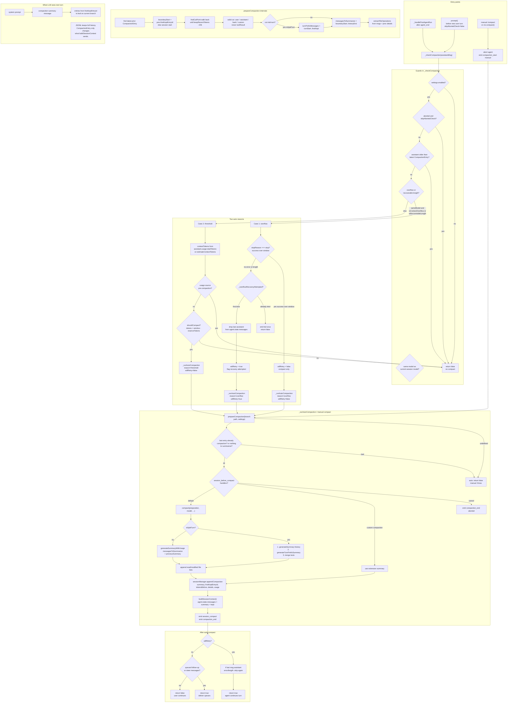

## Auto-compaction flow

Key files:
- `dist/core/agent-session.js` → `_checkCompaction`, `_runAutoCompaction`, `compact`
- `dist/core/compaction/compaction.js` → `shouldCompact`, `prepareCompaction`, `findCutPoint`, `compact`
- `dist/core/session-manager.js` → `appendCompaction`, `buildSessionContext`

Settings default: `enabled: true`, `reserveTokens: 16384`, `keepRecentTokens: 20000`.



## Trigger math

```text
threshold:  contextTokens > contextWindow - reserveTokens
default:    contextTokens > contextWindow - 16384

keepRecent: walk newest→oldest until ~20000 tokens kept
```

## Two auto reasons

| reason | when | willRetry |
| --- | --- | --- |
| `overflow` | context overflow error, or recoverable `length` stop, same model | `true` only if stop was not successful `stop` |
| `threshold` | usage / estimate over window − reserve | always `false` |

## Common failure / no-op paths

1. `compaction.enabled = false`
2. last assistant aborted (post-run path skips)
3. assistant older than latest compaction (stale usage guard)
4. overflow from different model than current
5. overflow recovery already tried once this cycle
6. no usage data and no estimable prior usage
7. usage source is pre-compaction message
8. `prepareCompaction` returns undefined (already compacted / nothing to cut / session too small)
9. extension cancels `session_before_compact`
10. summarization LLM error (emit fail, keep old context)

## Mental model

```text
JSONL branch path (immutable append)
  ...old msgs... | kept msgs... | CompactionEntry

LLM context rebuild:
  [system] + [summary from latest cmp] + [msgs from firstKeptEntryId → leaf]
```

Repeated compact re-summarizes from previous `firstKeptEntryId`, not from the compaction entry itself, so earlier kept msgs get folded into next summary.

---

If you want next step: dig why auto compact fail on your session. Paste footer context `%`, model `contextWindow`, and any `Auto-compaction failed` / `Context overflow recovery failed` line.
