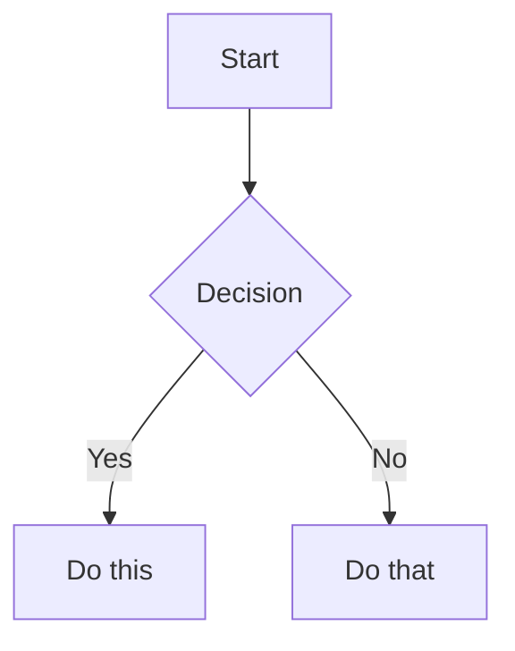

# Obsidian Vault Management

Obsidian is a local-first knowledge base built on plain markdown files. Vaults are directories of `.md` files that use Obsidian Flavored Markdown (OFM) -- an extension of CommonMark and GFM with wikilinks, embeds, callouts, properties, and plugin syntax.

## Finding the Vault

1. Look for an `AGENTS.md` or `.obsidian/` directory in the workspace or common locations.
2. Ask the user for the vault path if not obvious.
3. **Never assume or hardcode a vault path.** Never store vault-specific paths or content in global skill files.

## Workflow: Creating a Note

1. **Audit the vault** -- grep existing notes for `type:`, `tags:`, and folder structure to match conventions.
2. **Add frontmatter** at the top with properties. See [references/PROPERTIES.md](references/PROPERTIES.md).
3. **Write content** using standard Markdown plus Obsidian-specific syntax below.
4. **Link related notes** using `[[wikilinks]]` for internal connections, `[text](url)` for external.
5. **Embed content** using `![[embed]]` syntax. See [references/EMBEDS.md](references/EMBEDS.md).
6. **Add callouts** for highlighted info using `> [!type]` syntax. See [references/CALLOUTS.md](references/CALLOUTS.md).

## Wikilinks

```markdown
[[Note Name]]                          Link to note
[[Note Name|Display Text]]             Custom display text
[[Note Name#Heading]]                  Link to heading
[[Note Name#^block-id]]                Link to block
[[#Heading in same note]]              Same-note heading link
```

Define a block ID by appending `^block-id` to any paragraph, or on a separate line after lists/quotes:

```markdown
This paragraph can be linked to. ^my-block-id
```

**When to use:** `[[wikilinks]]` for vault-internal notes (Obsidian tracks renames). `[text](url)` for external URLs only.

## Embeds

```markdown
![[Note Name]]                         Embed full note
![[Note Name#Heading]]                 Embed section
![[image.png]]                         Embed image
![[image.png|300]]                     Embed image with width
![[document.pdf#page=3]]               Embed PDF page
```

Full embed reference: [references/EMBEDS.md](references/EMBEDS.md).

## Callouts

```markdown
> [!note]
> Basic callout.

> [!warning] Custom Title
> Callout with custom title.

> [!faq]- Collapsed by default
> Foldable (- collapsed, + expanded).
```

Common types: `note`, `tip`, `warning`, `info`, `example`, `quote`, `bug`, `danger`, `success`, `failure`, `question`, `abstract`, `todo`.

Full callout reference: [references/CALLOUTS.md](references/CALLOUTS.md).

## Properties (Frontmatter)

```yaml
---
title: My Note
date: 2024-01-15
tags:
  - category/topic
aliases:
  - Alternative Name
---
```

- `tags` -- searchable labels, supports `category/subcategory` hierarchy.
- `aliases` -- alternative names for link suggestions.
- Any custom key-value pairs are valid.

Full property reference: [references/PROPERTIES.md](references/PROPERTIES.md).

**Rules when editing notes:**
- Match the existing frontmatter schema the vault already uses. Do not invent new fields.
- Reuse existing `type` and `tag` values from sibling notes. Audit with `grep` before creating new ones.

## Tags

```markdown
#tag                    Inline tag in body
#nested/tag             Hierarchical tag
```

- Letters, numbers (not first char), underscores, hyphens, forward slashes.
- Also settable in frontmatter `tags:` array.
- Both methods are searchable.

## Comments

```markdown
Visible %%hidden%% text.

%%
Entire block hidden in reading view.
%%
```

## Formatting Extensions

```markdown
==Highlighted text==                   Highlight syntax
```

## Math (LaTeX)

```markdown
Inline: $e^{i\pi} + 1 = 0$

Block:
$$
\frac{a}{b} = c
$$
```

## Diagrams (Mermaid)

````markdown

````

Link Mermaid nodes to notes with `class NodeName internal-link;`.

## Footnotes

```markdown
Text with footnote[^1].

[^1]: Footnote content.

Inline footnote.^[This is inline.]
```

## Dataview Plugin

Dynamic queries inside notes:

```dataview
TABLE file.ctime as created, file.mtime as updated
SORT file.mtime DESC
```

```dataview
LIST
FROM "path/to/folder"
WHERE status = "active"
```

Scope with `FROM "folder"`, output as `TABLE` or `LIST`.

## Kanban Plugin

Kanban boards are markdown with columns as `##` headings and items as checkboxes:

```markdown
## TO DO
- [ ] Task description

## Complete
- [x] Done task
```

**Do not modify kanban structure without user approval.**

## Rules for Creating and Editing Notes

1. **Always match the vault's existing frontmatter schema.**
2. **Reuse existing `type` and `tag` values.** Audit the vault first.
3. **Add a body backlink** as the first line after frontmatter if the vault convention uses parent links.
4. **Add frontmatter `related` links** to connect to sibling and parent notes if the vault convention uses them.
5. **Code blocks must have language hints** (```bash, ```python, ```sql, ```yaml).
6. **Keep notes under 300 lines.** Split if too large.
7. **No emojis in filenames or titles.** ASCII only.
8. **Filename should match the title** in natural casing with `.md` extension.
9. **Place notes in the correct folder** matching the vault's existing organization.
10. **Prefer extending existing notes** over creating new files for small additions.

## Safety Guardrails

- **Never delete notes** without explicit user approval. Suggest archiving instead.
- **Never restructure folders** without explicit user approval. Wikilinks and plugins reference paths.
- **Never expose vault paths, credentials, or personal content** in skill files or external systems.
- **Never modify kanban boards** without asking.
- **Never change the frontmatter schema** without auditing the vault first.
- **Never store vault-specific information in this global skill.**
